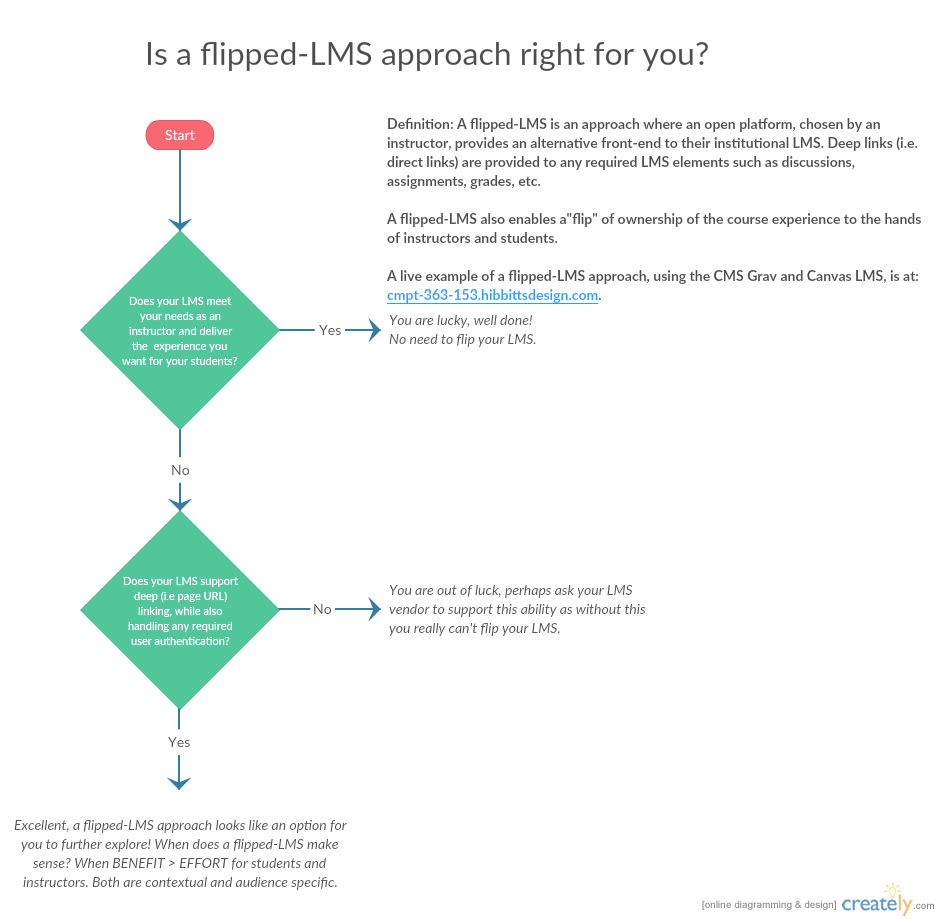

**Definition:**  
A flipped-LMS is an approach where an open platform, chosen by an instructor, provides an alternative front-end to their institutional LMS. Deep links (i.e. direct links) are provided to any required LMS elements such as discussions, assignments, grades, etc.

A flipped-LMS also enables a"flip" of ownership of the course experience to the hands of instructors and students.

A live example of a flipped-LMS approach, using the CMS Grav and Canvas LMS, is at:
[http://cmpt-363-153.hibbittsdesign.com](http://cmpt-363-153.hibbittsdesign.com).

_Figure 1. Basic flowchart to illustrate a flipped-LMS decision pathway _([http://bit.ly/201zVj0](http://bit.ly/201zVj0))
