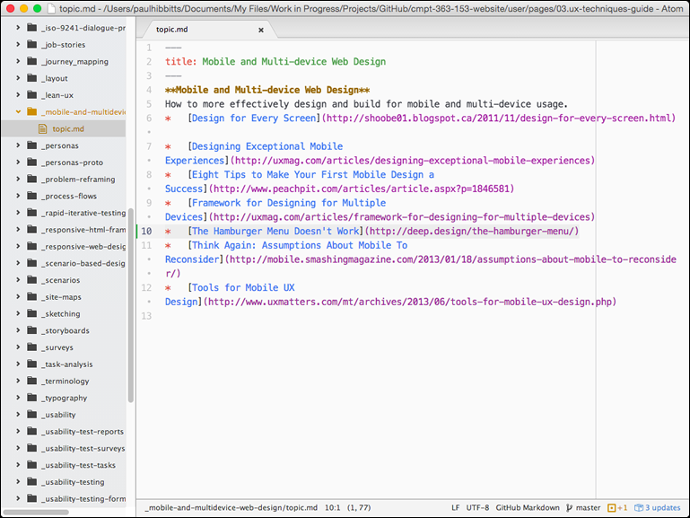
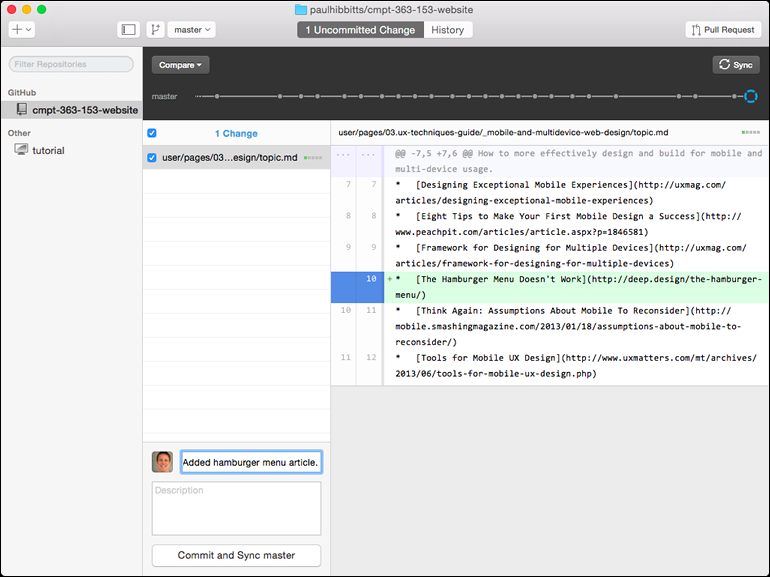
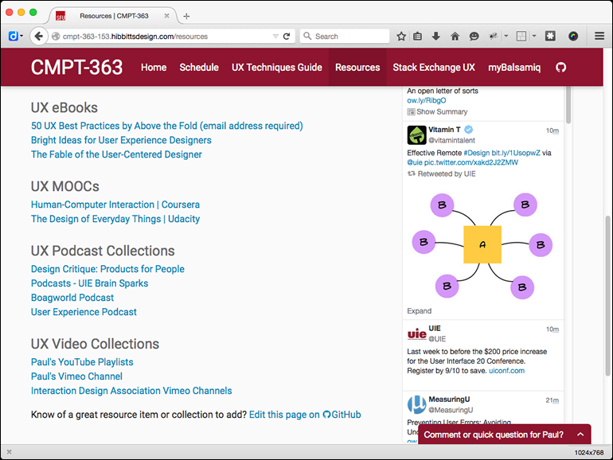

In my earlier LinkedIn article [Online Course Companions: Workflow Requirements for (us) Instructors](https://www.linkedin.com/pulse/online-course-companions-some-requirements-us-paul-hibbitts) I outlined the workflow requirements of providing the online course companion ([http://cmpt-363-153.hibbittsdesign.com/](http://cmpt-363-153.hibbittsdesign.com)) for my students this upcoming term at [Simon Fraser University](http://www.sfu.ca/). In this article I will describe the details of my current workflow, which meets all of the previously identified requirements.

The one element that makes everything possible is the open source CMS [Grav](http://www.getgrav.org/), which in addition to empowering me to provide a great user experience for my students, uses a non-database approach in which content and code are stored separately as text files (often referred to as a flat-file CMS). Within content text files it is possible to use plain text, [Markdown](http://daringfireball.net/projects/markdown/syntax) and HTML. Grav also supports modular content, which means content can be displayed in multiple areas and contexts but only needs to be stored once. Think [content blobs vs. chunks](http://ez.no/Blog/Blobs-vs.-Chunks-Understanding-True-Separation-of-Content-from-Presentation).

**Devices**

* MacBook Air (primary work platform)
* Surface Pro 3 (secondary work platform)
* Samsung Galaxy S5
* ASUS Nexus 7 Tablet

**Tools**
* [Grav](http://getgrav.org/) (Open source, multi-device, modular, flat-file CMS)
* GitHub [Account](https://github.com/paulhibbitts/) and [Repository](https://github.com/paulhibbitts/cmpt-363-153-website)
* [GitHub Desktop App](https://desktop.github.com/) (Mac and Windows)
* [Atom Text Editor App](https://atom.io/)
* [MAMP](https://www.mamp.info/en/) (local server environment for Mac and Windows)
* [Deploy](http://deployhq.com/) Account

**Workflow (Mac or Windows)**

Edit one or more course companion files in a text editor (e.g. Atom or any other of your choice)
Preview locally within a Browser using MAMP (optional step)
Review and commit changes to course companion GitHub repository via GitHub Desktop

_Figure 1. Adding a new article link in the Atom text editor (modular content that will be displayed in multiple areas of the site)._

_Figure 2. Previewing and then committing changes to the GitHub repository._

Once the changes have been pushed to the GitHub repository then Deploy can be configured to automatically get a notification and update the course companion site via SFTP. Priceless.

If I need to make a quick update with any mobile device I can do so via the GitHub website, and these will later be synced down to all my GitHub Desktop clients. These changes would also be automatically updated on the course companion site by Deploy via SFTP.

Let’s talk about two critical issues: time and trackability. In terms of time, I can now make simple changes to the course companion in a fraction of time (e.g. 30 seconds) that would be required by many database-driven LMS’s such as Canvas or Moodle. This is really important, as the faster (and easier for that matter) course companion updates are the more likely that us instructors will continue to make improvements throughout the term. Having each and every change made to the course companion be trackable, and essentially reversible, not only helps minimize possible errors but helps decrease the anxiety that often comes along with frequent (and not easily reversible, esp. with regards to code changes) site updates by the instructor.

**Awesomeness on Top of Awesomeness**
If the above is not enough benefit for this workflow, here comes the kicker: since all changes are flowed through GitHub, the entire course companion is not just in the open but also truly collaborative. Students can suggest changes, which are then previewed by the instructor and immediately applied or be the start of a further dialog with a student. In other words, a course companion (aka learning platform) that students and instructors can both contribute to and improve over time. And this is not just about content, but also code (i.e. functionality of the site) if your students are familiar with common Web languages, as my Simon Fraser University Computing Science students are. In fact, I’ve now come to the conclusion that this should be a baseline requirement for any learning platform of mine from now onwards.

_Figure 3. A course companion page with a "Edit this page on GitHub" link to seamlessly initiate the process of submitting changes via GitHub._

Well, there you have it. If you are interested in learning more about this workflow, or about my experiences of using [Grav CMS](http://www.getgrav.org/) as a means to support a flipped-LMS approach (in my case with the [Canvas LMS](http://www.canvaslms.com/)), please get in touch.
