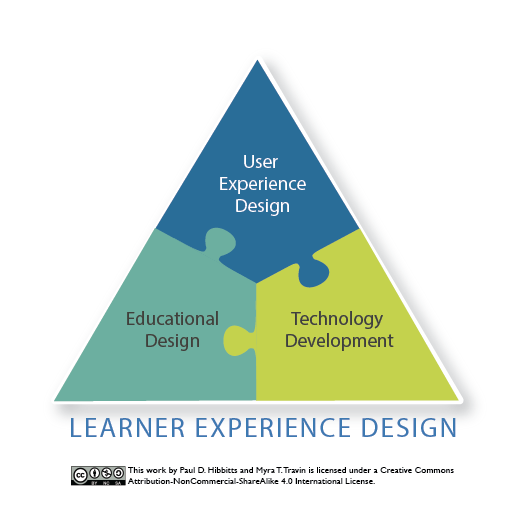

Learner experience design is the combination of user experience (UX) design, educational design, and technology development. All three domains are essential.

*Figure 1. Learner Experience Design Foundations, by Paul Hibbitts and [Myra Travin](https://twitter.com/m_travin)*
