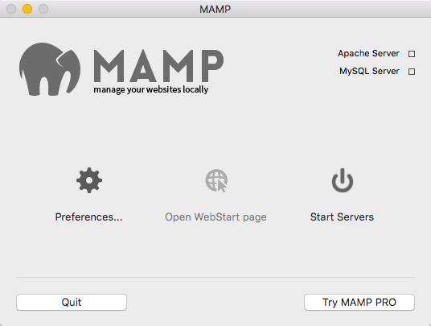

One of the (many) great things about [Grav](http://getgrav.org) is that no database setup is required, which makes running a local copy of Grav on your computer for testing purposes even easier. In this blog post, we will look at how to use [MAMP](https://www.mamp.info/en/), a tool to safely run PHP server on your computer, to locally run Grav on your Mac or Windows PC.

**Step-by-step Instructions**

1. Download MAMP (https://www.mamp.info/en/downloads/) and install the application
2. Download Grav (http://getgrav.org/downloads/) and extract downloaded archive file
3. Copy the entire extracted Grav folder to /Applications/MAMP/htdocs/' on a Mac or 'C:/MAMP/htdocs' on a Windows PC
4. Launch the MAMP application
5. Press the MAMP button 'Start Servers' (see Figure 1)
6. Enter the URL http://localhost and press the RETURN key
7. In your Browser press on the displayed Grav folder name
8. Done!

_Figure 1. MAMP startup screen._
