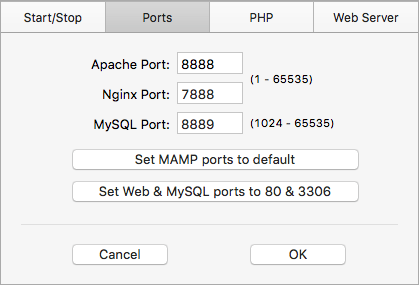

One of the (many) great things about [Grav](http://getgrav.org) is that no database setup is required, which makes running a local copy of Grav on your computer for development or testing purposes a straightforward process.  

In this brief article we will look at how to use [MAMP](https://www.mamp.info/en/), a tool to safely run PHP server on your computer, to run Grav locally on your Mac or Windows PC.

**Step-by-step Instructions**

1. Download MAMP (https://www.mamp.info/en/downloads/) and install the application
2. If you do not already have a copy of Grav on your computer, download it at (http://getgrav.org/downloads/) and extract the downloaded archive file
3. Copy your entire Grav folder to '/Applications/MAMP/htdocs/' on a Mac or 'C:/MAMP/htdocs' on a Windows PC
4. Launch the MAMP application and press the button 'Start Servers' (see Figure 1)
5. Launch your Web Browser and enter the URL http://localhost:8888 and then press the RETURN key

In your Web Browser you should now see the MAMP htdocs directory listing - press on the displayed Grav folder name to view your local Grav site

  
_Figure 1. MAMP startup screen._

Remember, once you've got your Grav site working as you want locally all you need to do is copy/FTP the files over to your server! No database (worries) required   

**Additional MAMP Setup Options**

If you would prefer to only need to enter 'http://localhost' in your Web Browser to access your MAMP htdocs directory listing, then do the following:

1. Launch the MAMP application. If MAMP is already running, press the 'Stop Servers' button
2. Press the MAMP 'Preferences' button (see Figure 1)
3. Press the 'Ports' tab in the 'Preferences' dialog (see Figure 2)
4. Change the value in the 'Appache Port' field to '80' (no quotes)
5. Press the 'OK' button  

  
_Figure 2. MAMP Preferences dialog._

Once you start using this setup for your Grav development you might also want to change the location of the document directory used by MAMP, for example when using GitHub Desktop or ensuring your files are routinely backed up. You can find the setting to change the MAMP  directory in the 'Web Server' tab of the 'Preferences' dialog.
