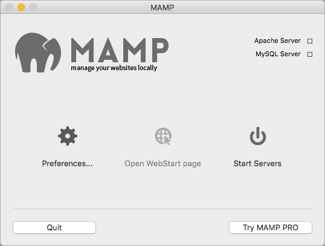

One of the (many) great things about using the open source CMS [Grav](http://getgrav.org) for a [flipped-LMS approach](http://hibbittsdesign.org/blog/redefining-a-flipped-lms-approach) is that no database is required, which makes running a local copy of Grav on your computer for testing purposes a very straightforward process. This also makes deployment to a Web server a breeze - just a simple folder copy.

In this brief article we will look at how to use [MAMP](https://www.mamp.info/en/), a tool to safely run a PHP server on your computer, to view Grav sites locally on your Mac or Windows PC.

**Step-by-step Instructions**

1. Download MAMP ([https://www.mamp.info/en/downloads/](https://www.mamp.info/en/downloads/)) and install the application
2. If you do not have an existing Grav site on your computer, download Grav at ([http://getgrav.org/downloads/](http://getgrav.org/downloads/)) and extract the downloaded archive file
3. Copy your entire Grav folder into '/Applications/MAMP/htdocs/' on a Mac or 'C:/MAMP/htdocs/' on a Windows PC
4. Launch the MAMP application and press the button 'Start Servers' (see Figure 1)

  
_Figure 1. MAMP startup screen._

With MAMP installed and running you can now view your Grav site(s) locally. Launch your Web Browser,  enter the URL http://localhost:8888 and then choose the displayed Grav folder name. That's it! Thanks to Grav no database needs to be created or configured.  

**Additional MAMP Setup Options**

If you would prefer, you only need to enter ‘http://localhost’ in your Web Browser to access your MAMP htdocs directory listing, then do the following:

1. Launch the MAMP application. If MAMP is already running, press the 'Stop Servers' button
2. Press the MAMP 'Preferences' button (see Figure 1)
3. Press the 'Ports' tab in the 'Preferences' dialog (see Figure 2)
4. Change the value in the 'Appache Port' field to '80' (no quotes)
5. Press the 'OK' button  

  
_Figure 2. MAMP Preferences dialog._

Once you start using this setup for your Grav development you might also want to change the location of the document directory used by MAMP, for example when using GitHub Desktop or ensuring your files are routinely backed up. You can find the setting to change the MAMP  directory in the 'Web Server' tab of the 'Preferences' dialog.

If you are curious about how a local copy of Grav can be used with GitHib/GitHub Desktop for super-easy deployments while fully supporting student collaboration, check out my [My Dream Workflow as an Instructor](../my-dream-workflow-as-an-instructor) article.
