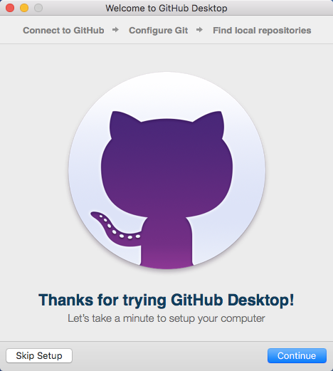
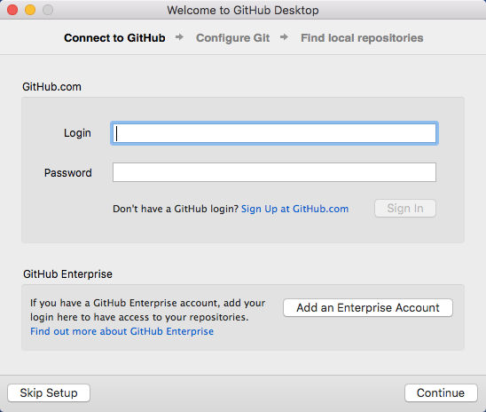
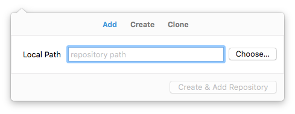
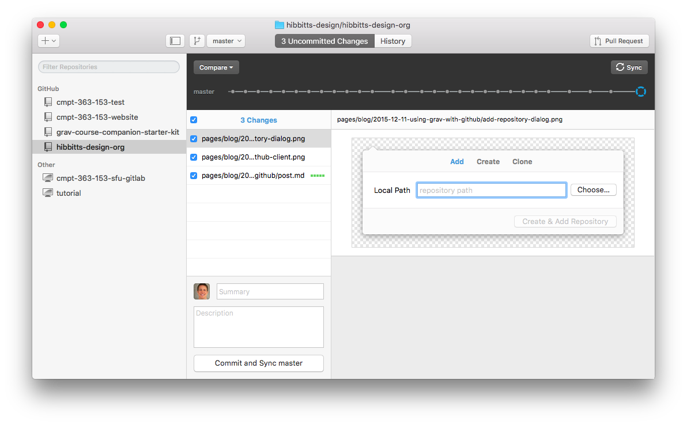
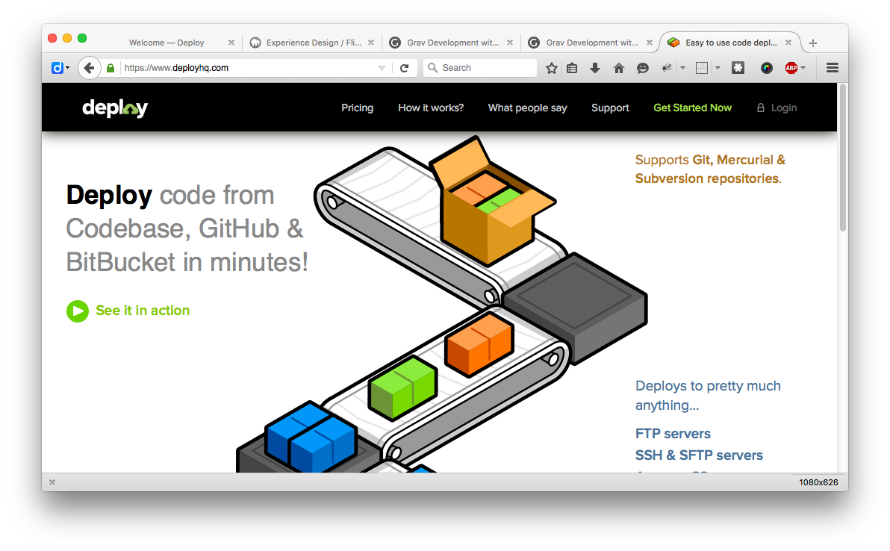

As a flat-file CMS, Grav can take advantage of today's ecosystem of open and collaborative editing environments, such as GitHub or GitLab. In this brief article we will look at how to easily use GitHub with Grav to result in a very efficient, open and collaborative workflow.

As an educator the use of GitHub to store (not host) an online course companion is very appealing, as not only does it support an open practice but also enables students to directly contribute to the very learning environment that they are using. I first described this workflow in my earlier article [My Dream Workflow as an Instructor](../my-dream-workflow).

Before you start this tutorial I suggest you first get your Grav site running locally using MAMP, as described in my earlier article [Running Grav Locally with MAMP](../running-grav-locally-with-mamp)

**Step-by-step instructions**

1. If you do not done so already, [sign up for a GitHub account](https://github.com/join).

2. Download the [GitHub Desktop](https://desktop.github.com/) client for your computer (Mac or PC), and once it is installed launch the application and enter your GitHub account credentials.

    
  _Figure 1. GitHub Desktop on the Mac - Setup Welcome._

    
  _Figure 2. GitHub Desktop on the Mac - Setup Connect to GitHub._

3. Assuming you already have a Grav site present on your computer (and ideally one that is already viewable via MAMP), you next need to create a GitHub Respository of your site. It is recommended that if this is the first time you are using GitHub with Grav you add the entire Grav site to GitHub, but other approaches are possible.

    
  _Figure 3. GitHub Desktop main window._

  Press the "Create & Add Repository" button (plus sign in the upper-right) in the client, select the "Add" tab, and then use the "Choose..." button to select the folder containing your entire Grav site.

    
  _Figure 4. Add respository dialog._

4. Before we make our first commit to GitHub, a ".gitignore" file should be created in the main (root) folder of your site. This will tell the GitHub Desktop client to ignore various unneeded files upon every sync to GitHub.

  Using the code editor of your choice (I recommend Atom by GitHub or Adobe Brackets) copy and paste the following into your ".gitignore" located in themain (root) folder of your site:

    ```
    # Grav Specific  
    .sass-cache
    composer.lock
    cache/*
    assets/*
    logs/*
    images/*
    user/data/*

    # OS Generated
    .DS_Store*
    ehthumbs.db
    Icon?
    Thumbs.db
    *.swp
    ```

5. You are now ready for your first commit to your new GitHub repository. Whenever you make a commit you will need to include a brief text summary - as this is your first commit enter the text "First commit." into the Summary text box, and then press the button "Commit and Sync master".

    
  _Figure 4. First commit._

6. Publish button and dialog?

7. Once this process is complete you should now be able to view your Grav site files on GitHub. Take a look now to verify this.

8. To maximize the benefit of using GitHub to store your Grav site files, you can use various tools and techniques to trigger an automatic update of changed GitHub files over to your live site. To make this step as easy as possible, I recommend using one of the various Web services that provide this functionality - my current favorite it [Deploy](deployhq.com).

    
  _Figure 5. Deploy website._

  Head over to [Deploy](deployhq.com), and sign-up for free account (one project, up to ten commits per day). Once you have signed up then create a project with the needed details of your web server location/credentials and then your GitHub repository information. Detailed documentation for these steps are available on the [Deploy support area](https://support.deployhq.com/).

Congratulations, if you've been able to complete all the above steps you now have a Grav site which you can run and test locally, and then with one click update your files on GitHub and have them automatically pushed to your Web server. Students can also now make suggested changes to your Grav site via GitHub.

  Interested in learning even more about using Grav with GitHub? Check out these two posts on the Grav Blog:
  * [Grav Development with GitHub - Part 1](http://getgrav.org/blog/developing-with-github-part-1)
  * [Grav Development with GitHub - Part 2](http://getgrav.org/blog/developing-with-github-part-2)
