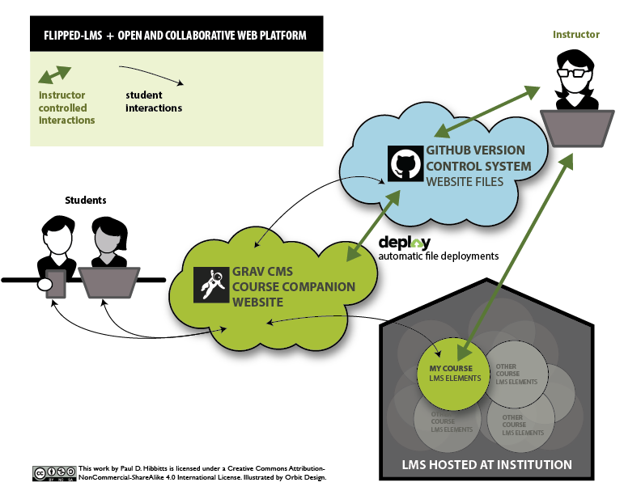

Just in time for the holidays, here is the ~~second~~ third iteration of some visualizations I've been working on recently:
* Flipped-LMS
* Open and collaborative Web platform
* Flipped-LMS approach using an open and collaborative platform (where the magic really happens)

  
_Figure 1. Flipped-LMS approach._
  
  
_Figure 2. Open and collaborative Web platform._
  
  
_Figure 3. Flipped-LMS approach using an open and collaborative Web platform._  
 
As a bonus, here is how I use [Grav](http://getgrav.org), [GitHub](http://github.com) and [Deploy](http://deployhq.com) all together to support an open and collaborative flipped-LMS approach:  
 
  

_Figure 4. Flipped-LMS approach using Grav CMS, GitHub, and Deploy._

It's also a good time to review why we would want to flip the LMS using an open and collaborative platform, and the related experience design goals of doing so:

Why flip the LMS?
* Support pedagogical goals unmet by current LMS/platform
* Increase capability of access, sharing and collaboration
* Deliver a better student (and facilitator) experience  

Experience design goals:
* For Students
    * Engaging
    * Organized
    * Relevant
    * Convenient
    * Enjoyable  
 
* For Facilitator(s)
    * Controllable (i.e. manageable)
    * Pliable (i.e. flexible)
    * Efficient
    * Enjoyable (hey, instructors are people too...)  

Interested in exploring a live example of a flipped-LMS using an open and collaborative platform? Visit my [SFU](http://www.sfu.ca) CMPT 363 site at [http://cmpt-363-153.hibbittsdesign.com/](http://cmpt-363-153.hibbittsdesign.com/) and its GitHub file repository at  [https://github.com/paulhibbitts/cmpt-363-153-website/](https://github.com/paulhibbitts/cmpt-363-153-website/).

You can learn more about the super efficient workflow that happens behind-the-scenes in my earlier article [
My Dream Workflow as an Instructor](../my-dream-workflow-as-an-instructor).
