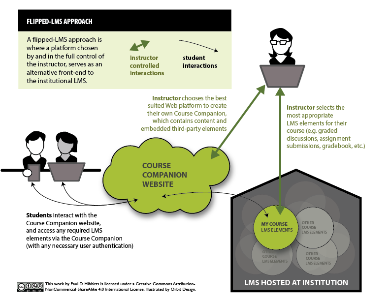
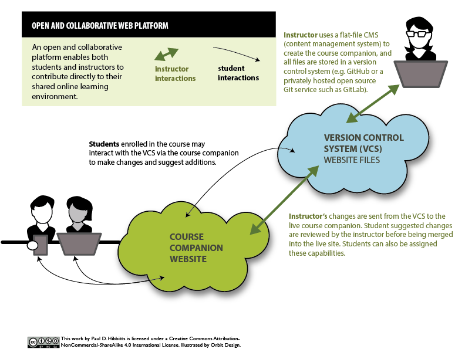

Just in time for the holidays, here is the second iteration of some visualizations I've been working on recently:
* Flipped-LMS
* Open and collaborative platform
* Flipped-LMS approach using an open and collaborative platform (where the magic really happens)

  
_Figure 1. Flipped-LMS approach._
  
  
_Figure 2. Open and collaborative platform._
  
  
_Figure 3. Flipped-LMS approach using an open and collaborative platform._

Interested in exploring a live example of a flipped-LMS approach using an open and collaborative platform? Visit my [SFU](http://www.sfu.ca) CMPT 363 course companion at [http://cmpt-363-153.hibbittsdesign.com/](http://cmpt-363-153.hibbittsdesign.com/), built with [Grav](http://getgrav.org).

You can also learn more about the super efficient workflow that happens behind-the-scenes in my earlier article [Using Grav with GitHub Desktop (and Deploy)](../using-grav-with-github-and-deploy).
